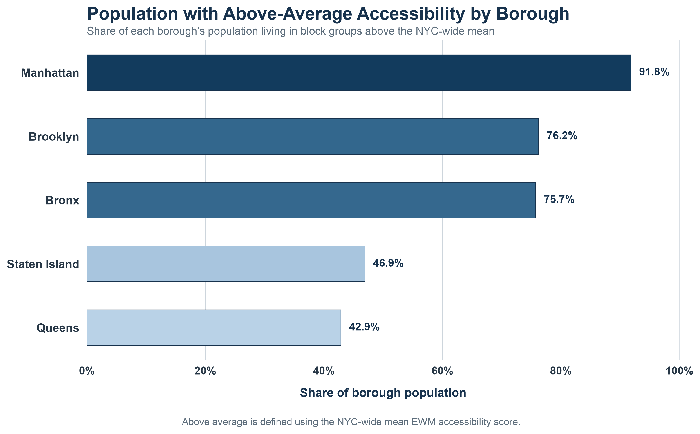

# NYC Healthcare Accessibility

This repository examines how easily New York City residents can reach hospitals by public transit. The analysis combines transit schedules, the pedestrian street network, hospital locations, census demographics, spatial statistics, and regression models at the census block-group level.

The central research question is whether public-transit access to hospitals varies across neighborhoods and demographic groups, and whether those relationships differ across the five boroughs.

## Study overview

The routing workflow uses MTA GTFS schedules and OpenStreetMap with `r5py`. Census block-group origins are connected to nearby hospitals, and detailed itineraries are reduced to six travel-burden indicators: total travel time, total distance, walking time, walking distance, waiting time, and transfers.

The Entropy Weight Method (EWM) combines those indicators into a single accessibility score without assigning subjective weights. The final scores are mapped in QGIS, evaluated using Getis-Ord Gi* hot spot analysis, and analyzed with OLS, quantile regression, and generalized additive models.

## Selected outputs

### Citywide accessibility


*Figure 1. Citywide EWM healthcare accessibility scores by census block group. Higher scores, shown in purple, indicate comparatively better public-transit access to hospitals; lower scores are shown in orange.*

### Spatial clustering of accessibility


*Figure 2. Statistically significant spatial clusters of high and low accessibility identified using Getis-Ord Gi\*. Hot spots represent clusters of higher scores, while cold spots represent clusters of lower scores.*

The Getis-Ord Gi* analysis identifies statistically significant clusters rather than simply labeling individual block groups as high or low. Cold spots are concentrations of comparatively lower accessibility, while hot spots are concentrations of higher accessibility.

### Above-average accessibility by borough



*Figure 3. Share of each borough’s population living in census block groups with accessibility scores above the citywide mean. Manhattan has the largest share, followed by Brooklyn and the Bronx; Queens and Staten Island have the smallest shares.*

## Key findings

- The citywide OLS model includes 6,347 block groups and has an adjusted R-squared of 0.184. The measured demographic variables explain part, but not most, of the citywide variation in accessibility.
- No-vehicle prevalence and public-transit commuting are positively associated with the accessibility score in the citywide model. Uninsured, Black non-Hispanic, and Hispanic population shares have negative associations.
- Quantile-regression results are not uniform across the accessibility distribution. The positive no-vehicle association is strongest in lower-accessibility areas and becomes smaller at higher quantiles.
- Borough results differ substantially. Queens has the strongest adjusted model fit among the borough tables, while Manhattan has the weakest.

These are statistical associations, not causal estimates. Full results and qualifications are provided in [`results/`](results/) and [`docs/methodology.md`](docs/methodology.md).

## Repository structure

| Folder | Contents |
|---|---|
| [`code/`](code/) | Data collection, preprocessing, routing, regression, spatial analysis, validation, and visualization |
| [`data/`](data/) | Raw inputs, processed datasets, and manifests for large external files |
| [`docs/`](docs/) | Methodology, data sources, workflow, licensing notes, and research decisions |
| [`figures/`](figures/) | Final charts, citywide maps, and model figures |
| [`gis/`](gis/) | QGIS project files and organized spatial layers |
| [`notebooks/`](notebooks/) | Citywide and borough EWM calculations |
| [`results/`](results/) | Final regression tables and a findings summary |
| [`paper/`](paper/) | Reserved for manuscript materials that can be shared |
| [`presentation/`](presentation/) | Reserved for presentation materials that can be shared |

## Reproducing the scripted work

The recommended Python setup uses Conda or Mamba:

```bash
conda env create -f environment.yml
conda activate nyc-healthcare-access
```

For a pip-based environment:

```bash
python -m venv .venv
source .venv/bin/activate
python -m pip install -r requirements.txt
```

Run the repository checks before any analysis:

```bash
python code/validate_repository.py
```

The pipeline launcher exposes the safe scripted stages without claiming to reproduce the manual GIS or omitted itinerary-reduction steps:

```bash
python code/run_pipeline.py --list
python code/run_pipeline.py validate
python code/run_pipeline.py safe --dry-run
```

See [`docs/workflow.md`](docs/workflow.md) for the complete research sequence and [`code/README.md`](code/README.md) for Python, R, Java, and QGIS requirements.

## External inputs and limitations

Large GTFS archives, the OpenStreetMap PBF, OD candidate files, and full routing outputs are not stored in GitHub. Their expected filenames, sources, checksums, and placement are documented in [`data/external/`](data/external/).

Some preparation was completed in QGIS, and the repository does not contain a complete script for hospital filtering, nearest-hospital candidate generation, fastest-OD selection, or conversion of raw itinerary segments into all six EWM indicators. These gaps are documented rather than hidden.

The final SRA paper and presentation are not included because they were created using program resources. The corresponding folders are retained only as placeholders if those materials can be shared later.
